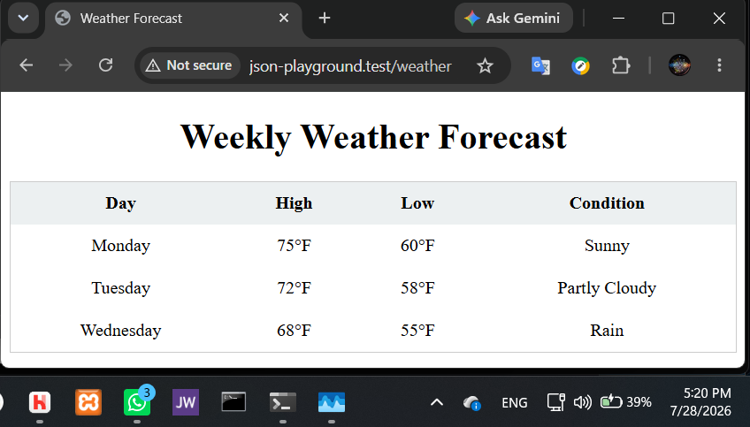

# Laravel App Using API w/ JSON
CS 85 Module 11, Assignment 11A, by Gregory Hagen, 7/28/26

## Setup Instructions

### Prerequisites
- Laravel Herd (includes PHP 8.4 and Composer)
- Git

### Installation

1. In your CLI, cd to your \Herd\ folder (e.g., `C:\Users\YourName\Herd\` ) and clone the repository there:
```
git clone https://github.com/Greg01001000/cs85_module11a.git

cd cs85_module11a
```

2. Install PHP dependencies:
```
composer install
```

3. Copy the environment file and generate an app key:
```
cp .env.example .env
php artisan key:generate
```

4. Make sure the Herd app is running with the web server (e.g., services NGINX and PHP-8.4) active, and visit the app in your browser at `http://cs85_module11a.test/weather`


### Notes
- No database is required — this app reads from a static JSON file
  at `storage/app/private/weather.json`
- No npm or Node.js is required — this app uses no compiled assets
- No migrations are required

## Resulting Web Page
